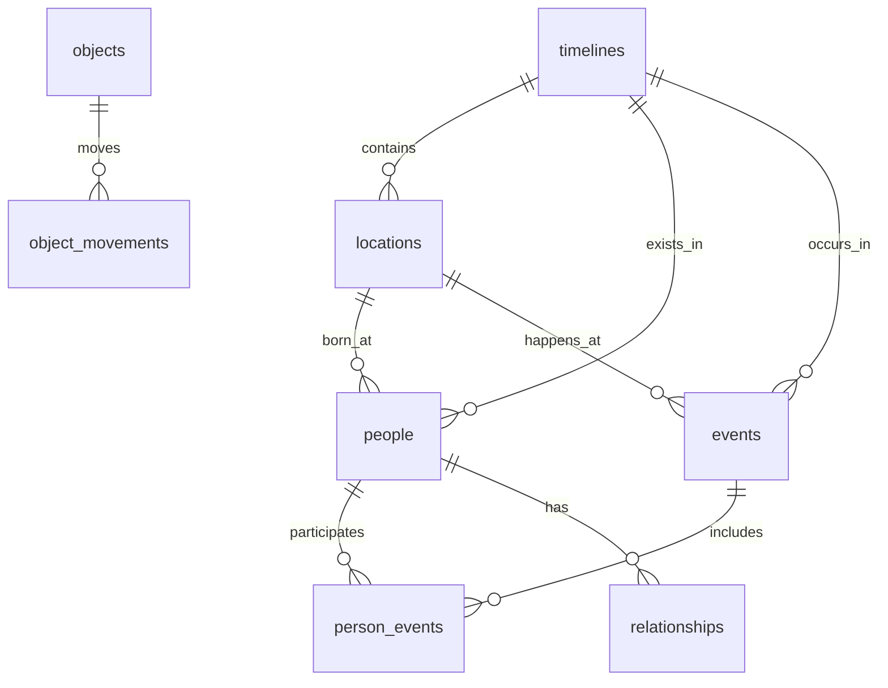

# ⏳ ChronoQuery

> *"Time is stored in a database. Reality is data. And someone's been editing the records."*

[](https://www.microsoft.com/sql-server)
[](LICENSE)
[](CONTRIBUTING.md)

An educational SQL game where you investigate temporal anomalies by writing database queries. Play as a Time Bureau agent solving increasingly complex puzzles to detect paradoxes and repair the timeline.


## 🎮 Game Concept

You're a temporal detective working for the Time Bureau. Reality itself is stored in a vast database, and temporal rifts manifest as **data inconsistencies**. Use your SQL skills to:

- 🔍 Detect temporal paradoxes (birth after death, impossible encounters)
- 📦 Find anachronistic objects (smartphones in Ancient Rome)
- 👥 Locate duplicate entities across timelines
- ⚡ Trace cause-and-effect violations
- 🌍 Validate location-time consistency

## ✨ Features

### 🎯 Progressive Learning System
- **30 Missions** across 4 difficulty phases
- **Academy (1-5)**: Basic SELECT, WHERE, ORDER BY
- **Field Agent (6-12)**: JOINs, aggregations, GROUP BY
- **Senior Investigator (13-20)**: Subqueries, CTEs, window functions
- **Time Lord (21-30)**: Advanced queries, complex joins, set operations

### 🏗️ Comprehensive Database Schema
- **9 Core Game Tables**: timelines, locations, people, events, objects, relationships, anomalies
- **8 Game Mechanics Tables**: players, missions, hints, progress tracking, leaderboard
- **Built-in Views**: Active anomalies, player stats, timeline violations
- **Stored Procedures**: Query validation, mission unlocking, hint system
- **Triggers**: Automatic anomaly detection, score calculation

### 🎨 Rich Game Mechanics
- ⭐ **Scoring System**: Performance-based rewards
- 💡 **3-Tier Hint System**: Get help when stuck (with score penalties)
- 🏆 **Achievements**: Unlock badges for special accomplishments
- 📊 **Leaderboard**: Compete with other temporal detectives
- 📈 **Progress Tracking**: Save your journey through time

## 🚀 Quick Start

### Prerequisites
- SQL Server 2019 or higher
- SQL Server Management Studio (SSMS) or Azure Data Studio

### Installation

1. **Clone the repository**
```bash
git clone https://github.com/yourusername/chronoquery.git
cd chronoquery
```

2. **Run the setup script**
```sql
-- Open ChronoQuery_Setup.sql in SSMS and execute
-- This will create the database, tables, and seed initial data
```

3. **Verify installation**
```sql
USE ChronoQuery;
SELECT * FROM vw_active_anomalies;
```

You should see 4 active anomalies ready to investigate!

## 📖 How to Play

### Starting Your First Mission

```sql
-- View available missions
SELECT mission_number, mission_name, difficulty_level, description
FROM missions
WHERE mission_number = 1;

-- Read the mission briefing
SELECT briefing FROM missions WHERE mission_number = 1;

-- Write your query to solve the mission
-- Example for Mission 1: Find the misplaced artifact
SELECT * 
FROM objects 
WHERE current_location_id = 1 
  AND creation_date > '1900-01-01';
```

### Getting Hints

```sql
-- If you're stuck, request a hint (costs points!)
EXEC sp_get_hint 
    @player_id = 1, 
    @mission_id = 1, 
    @hint_level = 1;
```

### Submitting Your Solution

```sql
-- Submit your query for validation
EXEC sp_submit_query 
    @player_id = 1,
    @mission_id = 1,
    @submitted_query = 'YOUR SQL QUERY HERE';
```

## 🗂️ Database Schema

### Core Tables



### Key Tables
- **timelines**: Alternate timeline versions
- **locations**: Places with temporal validity periods
- **people**: Characters with birth/death dates
- **events**: Temporal occurrences
- **person_events**: Junction table tracking who was at which event
- **objects**: Items that can be displaced in time
- **anomalies**: Detected temporal violations

## 🎓 Sample Missions

### Mission 1: The Misplaced Artifact
**Difficulty**: ⭐ Easy  
**Skills**: Basic SELECT, WHERE clause  
**Objective**: Find objects in Ancient Rome created after 500 AD

### Mission 2: Age Paradox
**Difficulty**: ⭐ Easy  
**Skills**: Comparison operators, NULL handling  
**Objective**: Find people born after they died

### Mission 3: Duplicate Detection
**Difficulty**: ⭐⭐ Medium  
**Skills**: GROUP BY, HAVING, aggregation  
**Objective**: Find duplicate people in the same timeline

### Mission 4: The Orphaned Event
**Difficulty**: ⭐⭐⭐ Advanced  
**Skills**: JOINs (LEFT, INNER)  
**Objective**: Find events with no corresponding participants

## 🏆 Achievements

| Achievement | Description | Points |
|-------------|-------------|--------|
| 🎓 First Steps in Time | Complete your first mission | 100 |
| 🎖️ Academy Graduate | Complete all Academy missions (1-5) | 500 |
| 🔍 Paradox Hunter | Find 10 temporal paradoxes | 250 |
| ⚡ Speed Demon | Complete a mission in under 60 seconds | 300 |
| 💎 Perfect Detective | Complete without using hints | 200 |
| 👑 Time Lord | Complete all 30 missions | 5000 |

## 🔧 Built-in Tools

### Views
- `vw_active_anomalies`: Currently detected temporal violations
- `vw_player_stats`: Player performance metrics
- `vw_timeline_violations`: Common paradox patterns

### Stored Procedures
- `sp_submit_query`: Validate and score player solutions
- `sp_unlock_next_mission`: Progress through the game
- `sp_get_hint`: Access mission hints
- `sp_update_leaderboard`: Refresh rankings

### Functions
- `fn_age_at_event`: Calculate person's age during an event
- `fn_is_valid_location_date`: Validate temporal location consistency

## 📊 Example Anomalies in the Database

```sql
-- Smartphone in Ancient Rome (temporal_displacement)
SELECT * FROM objects 
WHERE object_id = 3;

-- Person born after death (age_paradox)
SELECT * FROM people 
WHERE person_id = 4;

-- Duplicate entities (duplicate_entity)
SELECT person_name, birth_date, COUNT(*) 
FROM people 
GROUP BY person_name, birth_date 
HAVING COUNT(*) > 1;

-- Event before birth (impossible_encounter)
SELECT * FROM person_events pe
JOIN people p ON pe.person_id = p.person_id
JOIN events e ON pe.event_id = e.event_id
WHERE e.event_date < p.birth_date;
```

## 🎯 Learning Objectives

By completing ChronoQuery, players will master:

- ✅ Basic SQL syntax and structure
- ✅ Filtering data with WHERE clauses
- ✅ Sorting and limiting results
- ✅ JOIN operations (INNER, LEFT, RIGHT, FULL)
- ✅ Aggregate functions (COUNT, SUM, AVG, MIN, MAX)
- ✅ GROUP BY and HAVING clauses
- ✅ Subqueries and correlated subqueries
- ✅ Common Table Expressions (CTEs)
- ✅ Window functions (ROW_NUMBER, RANK, LAG, LEAD)
- ✅ Date/time calculations
- ✅ Set operations (UNION, INTERSECT, EXCEPT)
- ✅ Complex multi-table queries
- ✅ Query optimization and performance

## 🛠️ Development Roadmap

- [x] Core database schema
- [x] Mission system with 5 Academy levels
- [x] Player progress tracking
- [x] Hint system
- [x] Achievement system
- [ ] Complete 25 remaining missions (6-30)
- [ ] Web-based UI with SQL editor
- [ ] Real-time query validation
- [ ] Interactive timeline visualization
- [ ] Multiplayer leaderboard
- [ ] Daily challenges
- [ ] Custom mission creator

## 🤝 Contributing

We welcome contributions! Whether it's:
- 🎮 New mission ideas
- 🐛 Bug fixes
- 📝 Documentation improvements
- ✨ New features

Please see [CONTRIBUTING.md](CONTRIBUTING.md) for guidelines.

## 📝 Mission Template

Want to create your own missions? Use this template:

```sql
INSERT INTO missions (mission_number, mission_name, phase, difficulty_level, 
                      description, briefing, success_criteria)
VALUES (
    X, 
    'Mission Name',
    'Phase Name',
    1-10,
    'Short description',
    'Detailed briefing with story context',
    'What the query should return'
);

-- Add hints
INSERT INTO mission_hints (mission_id, hint_level, hint_text, score_penalty)
VALUES 
    (X, 1, 'First hint - general direction', 10),
    (X, 2, 'Second hint - specific approach', 25),
    (X, 3, 'Third hint - nearly the solution', 50);
```

## 📄 License

This project is licensed under the MIT License - see the [LICENSE](LICENSE) file for details.

## 🙏 Acknowledgments

- Inspired by SQL murder mystery games
- Built for SQL learners of all levels
- Special thanks to time travelers everywhere

## 📞 Support

- 📧 Email: acsqlworks@gmail.com
- 💬 Discord: [Join our community](#)
- 🐛 Issues: [GitHub Issues](https://github.com/acsqlworks/chronoquery-sql-game/issues)

---

<div align="center">

**⏰ Time waits for no query. Start your investigation today! ⏰**

[Get Started](#quick-start) • [View Missions](#sample-missions) • [Join Discord](#)

Made with MySQLServer

</div>
